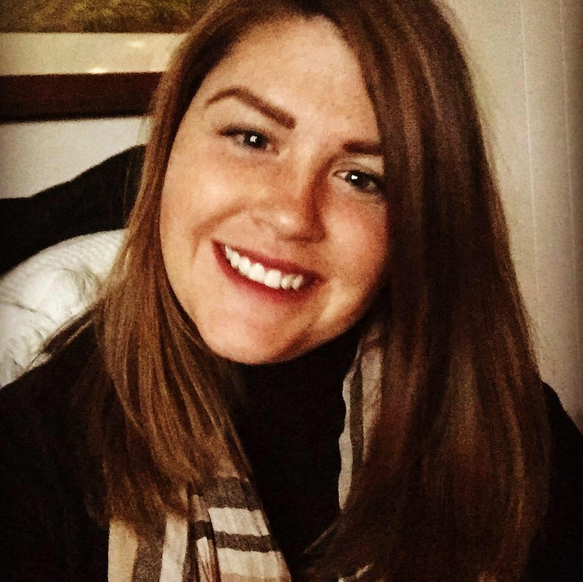

Hello! 

I was born and raised in a suburb of Cleveland, Ohio and graduated with a Bachelor's of Science in Biochemistry from Ohio Northern University. Through my alma mater, I managed to find a job as a research technician for a pulmonary stem cell lab at Boston Children's Hospital. This is where my Union Square story began. 

I had 12 hours to meet my roommate and find an apartment and we lucked out finding an affordable apartment at the top of Prospect Hill in Union Square. Fast forward one year and I met my boyfriend, Nick, at a mutual friend's wedding. As luck continued, I discovered he also lived in Union Square at the bottom of Prospect Hill! Our two dogs, Stormy and Demetri, love going on long walks over to the dog park at Nunziato field. Nick and I enjoy eating at all of the restaurants in Union Square and sampling the local breweries. Over the past 3.5 years as a Union Square resident, I have claimed this neighborhood as my physical New England foundation and have fallen in love with everything it has to offer. 

I work as a full time Clinical Research Coordinator for a private ophthalmology practice that serves Boston and the greater area. As a CRC, I spend every day providing innovative care to patients ultimately improving their standard of care. I also work with a vast spread of local to international pharmaceutical and research companies as well as the National Institutes of Health. I believe this experience in caring for each patient as the unique individual they are while balancing a working relationship with a variety of corporate sponsors will be crucial in the coming development plans for Union Square. 

In my spare time I volunteer for Boston Health Care for the Homeless Program (BHCHP) in which I have created and founded a new community initiative to teach CPR and basic first aid to the patients at BHCHP. In working with several directors and hearing what the patients want, I am thrilled for this program to begin in the near future. The groundwork for this project has included liability approval, financial requests, contacting BHCHP partners, and adequate data collection to provide evidence for the potential benefits of the Citizen Protection and Rescue program. USNC will require just as much groundwork which I am fully prepared to commit to.

I want to preserve the integrity of this incredible community as the master developer, US2, introduces and moves forward with its plans for development and growth. With the Green Line Extension finally in motion, it is understandable that change will come to Union Square. I am confident though, through proper communication, planning, and respect for our community, Union Square will maintain the affordability and charisma that attracted me to this neighborhood fresh out of Ohio. 

